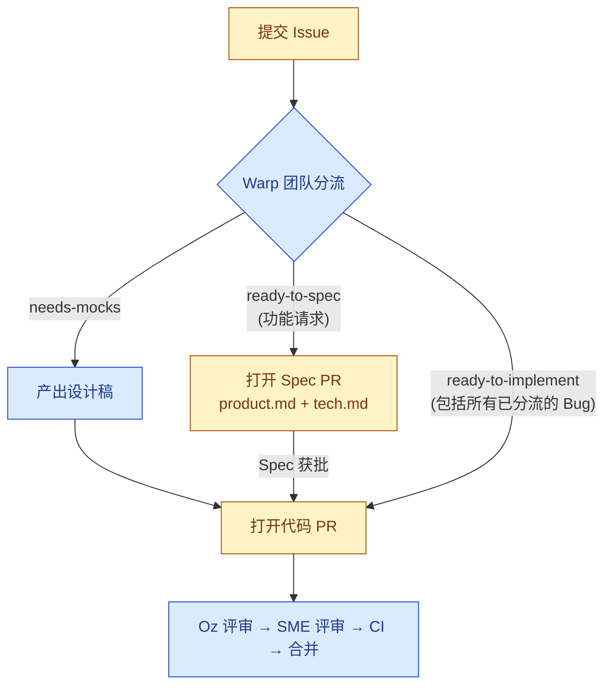

# 为 Warp 做贡献

感谢你帮助改进 Warp！本指南将说明如何提交 Issue、提出变更建议，以及如何让你的工作通过评审。

> [!TIP]
> **在 Slack 中与我们交流。** 你可以在 [`#oss-contributors`](https://warpcommunity.slack.com/archives/C0B0LM8N4DB) 频道与其他贡献者和 Warp 团队成员交流——这里适合提出临时问题、讨论设计方案，以及在处理 Issue 或 PR 时与维护者结对协作。如果你是新成员，请先[加入 Warp Slack 社区](https://go.warp.dev/join-preview)，然后进入 `#oss-contributors` 频道。

## TL;DR

- 欢迎为任何 Issue 提交 Bug 修复。所有 Bug 默认标记为 `ready-to-implement`。
- 功能请求（Feature Request）必须被标记为 `ready-to-spec` 或 `ready-to-implement` 后，才会接受对应的 PR。
- Spec（规格说明）是对较大 Issue 进行技术和设计讨论的场所。
- Oz 会自动对收到的 Issue 进行分流（triage），并对开放的 PR 进行评审。

## Warp 的贡献机制如何运作

Warp 的贡献模型由 [Oz](https://oz.warp.dev) 驱动。Oz 是一个智能代理，能够自动化部分分流、Spec 编写、代码实现和评审工作。与典型的开源仓库相比，这里的运作方式有一些不同：

- **Issue 是一切工作的起点。** 在打开任何 PR 之前，讨论、范围界定和设计都应在 Issue 上进行。这确保了所有参与者对问题和方案达成共识，避免无效的编码工作。
- **功能请求与 Bug 修复的流程不同：**
  - 功能请求受就绪标签（readiness labels）管控——先是 `ready-to-spec`，当设计方案确定后变为 `ready-to-implement`——这些标签信号告知贡献者何时可以开始工作。仅仅在 Issue 中讨论并不意味着获得了开始工作的许可。
  - 功能请求需要先撰写书面 Spec：功能请求需经过 Spec PR 流程（即将 *product spec*（产品规格）和 *tech spec*（技术规格）提交到 [`specs/`](specs/) 目录下），然后才能编写任何代码。Spec 的作用是确保设计思路在编码前得到充分讨论和认可。
  - Bug 修复跳过上述两个步骤；Bug 一旦经过分流确认，即隐式为 `ready-to-implement`，可以直接开始修复。
- **评审主要由自动化完成。** 当你打开一个 PR 时，Oz 会被自动指派并生成初步评审。Oz 批准后，它会自动请求 Warp 团队的相关领域专家（SME）进行后续评审——你无需自行指派人工评审者。

### 就绪标签（Readiness Labels）

Warp 团队会在 Issue 准备好接受贡献时，为其添加以下标签之一：

- **`ready-to-spec`** — 问题已被理解，但设计方案尚待确定。此时应打开一个 Spec PR，在 [`specs/`](specs/) 目录下提交 *product spec*（`product.md`）和 *tech spec*（`tech.md`）——参见下方 [打开 Spec PR](#打开-spec-pr) 部分了解每个文件应包含的内容。此标签**仅适用于功能请求**。
- **`ready-to-implement`** — 设计方案已确定。此时应打开代码 PR。**所有经过分流的 Bug 报告在被接受后即隐式为 `ready-to-implement`**——你无需等待一个显式标签即可开始修复已确认的 Bug。
- **`needs-mocks`** — 在实现开始之前需要设计稿（Design Mocks）。请等待 Warp 团队提供。

任何人都可以认领一个就绪的 Issue——就绪标签并非指派，最佳实现方案将通过正常的评审流程胜出。如果某个 Issue 长时间未被分流，或者你希望重新评估其就绪状态，请在评论中提及 **@oss-maintainers** 以提醒团队关注。

## 贡献流程

由你（贡献者）负责的步骤显示为黄色；由 Warp 团队或 Oz 负责的步骤显示为蓝色。



## 提交高质量的 Issue

在提交之前，请先搜索[已有 Issue](https://github.com/warpdotdev/warp/issues) 以避免重复。提交时请使用 Issue 模板。

如果你已经在使用 Warp，最快的提交方式是使用 `/feedback` 命令——它会自动打开一个公开的 GitHub Issue，并附带相关上下文信息（日志、环境详情等）。

### Bug 报告

一份高质量的 Bug 报告应包含：

- 清晰的标题和一段简明的问题概述。
- 可复现的步骤（尽可能提供最小化示例）。最小化示例有助于维护者快速定位问题，减少来回沟通的成本。
- 期望行为与实际行为的对比。
- Warp 版本和操作系统信息（可在 `Settings → About` 中查看）。
- 相关的日志、截图或屏幕录制。

Issue 一旦被分流确认为 Bug（由 Oz 的分流代理或维护者完成），即隐式为 **`ready-to-implement`**——你可以直接认领并打开代码 PR，无需等待额外的标签。

### 功能请求

一份高质量的功能请求应在提出任何实现方案之前，先描述用户面临的问题。请包含：

- 用户需求或痛点，以及受影响的用户群体。明确谁会受益有助于评估优先级。
- 当前行为及其不足之处。
- 期望行为或工作流程的概要描述（简短的示例或 Mock 有帮助但非必需）。
- 相关约束条件（兼容性、相关功能、已有方案等）。

功能请求走的是 Spec 流程：当问题被理解且设计对贡献者开放时，维护者会添加 **`ready-to-spec`** 标签。接下来的步骤是打开 Spec PR——而不是直接打开代码 PR。

自动分流可能会添加信息性标签（如 `area:*`、`repro:*` 等），这些标签不影响就绪状态。

## 打开 Spec PR

标记为 `ready-to-spec` 的 Issue 需要先完成 Spec 才能开始编码。Spec 由两份简短文档组成，提交到 [`specs/GH<issue-number>/`](specs/) 目录下：

- **`product.md`**（*product spec*，产品规格）—— 从消费者视角（用户、API 调用者、CLI 用户等）定义期望行为，不涉及实现细节。核心内容是一个编号列表，列出**可测试的行为不变式（behavior invariants）**，覆盖正常路径、用户可见状态、输入与响应、以及边界情况（空值/错误/加载中、取消操作、离线状态、权限拒绝、竞态条件、无障碍访问等）。可选章节：问题陈述、目标/非目标、Figma 链接、待解决问题。
- **`tech.md`**（*tech spec*，技术规格）—— 基于本代码库的实现计划。必需章节：**Context**（当前系统架构和相关文件，附带行号引用）、**Proposed changes**（涉及的模块、新增的类型/API/状态、数据流、权衡取舍）、**Testing and validation**（如何验证 product spec 中的每个不变式）。可选：端到端流程、Mermaid 图表、风险分析、并行化方案、后续工作。

打开 Spec PR 的步骤：

1. 添加 `specs/GH<issue-number>/product.md` 和 `specs/GH<issue-number>/tech.md`。参考 [`specs/GH408/`](specs/GH408/)、[`specs/GH1063/`](specs/GH1063/) 和 [`specs/GH1066/`](specs/GH1066/) 中结构良好的 Spec 示例，也可以浏览 [`specs/`](specs/) 目录查看更多。[`/write-product-spec`](.agents/skills/write-product-spec/SKILL.md) 和 [`/write-tech-spec`](.agents/skills/write-tech-spec/SKILL.md) 技能可以帮助你快速搭建这些文档的框架。
2. 将 PR 作为产品和技术讨论的场所。在 PR 中与维护者讨论设计细节，确保方案在实现前达成共识。
3. Spec 获批后，实现工作通常在同一 PR 上继续。在少数情况下——例如一个大型 Spec 单独合并以便将实现拆分为多个部分——可以转移到关联的后续 PR。

## 打开代码 PR

对于标记为 `ready-to-implement` 的 Issue（包括所有已分流的 Bug）：

1. 从 `master` 分支创建新分支。
2. 实现变更并添加测试（参见 [测试](#测试)）。
3. 运行 `./script/presubmit` 并在推送前修复所有失败项。此脚本会执行格式化、Clippy 检查和测试，确保代码符合基本质量标准。
4. 使用[Pull Request 模板](.github/pull_request_template.md)打开 PR，并添加 Changelog 条目（`CHANGELOG-NEW-FEATURE`、`CHANGELOG-IMPROVEMENT` 或 `CHANGELOG-BUG-FIX`）；仅文档变更或纯重构可省略 Changelog 条目。
5. 保持 PR 聚焦于单一逻辑变更，并在 PR 进入评审前合并 `master` 的最新更改。

你**无需手动请求评审者**。Oz 会被自动指派到关联就绪 Issue 的 PR 上，并生成初步评审。Oz 批准后，它会自动请求 Warp 团队相关领域专家进行后续评审。

在推送修改以回应 Oz 的反馈后，在 PR 上评论 `/oz-review` 以请求重新评审——每个 PR 最多可使用 **三次**。如果进展停滞或需要更多评审次数，请在 PR 上提及 **@oss-maintainers** 以升级到团队处理。

## 使用编程代理（Coding Agent）

你可以使用**任何编程代理**来实现贡献——例如 Warp 内置代理、Claude Code、Codex、Gemini CLI 或其他工具——也可以完全不使用代理。本仓库提供了代理可读的上下文信息（[`.agents/skills/`](.agents/skills/) 下的技能、[`specs/`](specs/) 下的规格文档、以及 [`WARP.md`](WARP.md)），任何支持这些格式的代理框架都可以读取。

如果你希望 **Oz 云代理** 来帮你实现一个就绪的 Issue，请在 Issue 上提及 **@oss-maintainers** 提出请求。获批的请求将使用免费的 Oz 额度运行——你无需自行注册 Oz 账户或支付计算费用。

## 代码评审

所有 Pull Request 都经过两阶段评审流程：

1. **Oz 评审** — 当你打开 PR 时，[Oz](https://warp.dev/oz) 会被自动指派并生成第一轮评审。Oz 会检查代码正确性、风格、测试覆盖率，以及与关联 Issue 和相关 Spec 的一致性。
2. **Warp 团队评审** — 仅在 Oz **批准** PR 之后，才会被路由到 Warp 团队的领域专家进行最终人工评审。尚未获得 Oz 批准的 PR 不会被指派给团队成员。

你在任何阶段都无需手动请求评审者。在推送修改以回应 Oz 的反馈后，在 PR 上评论 `/oz-review` 以请求重新评审——每个 PR 最多可使用 **三次**。如果进展停滞或需要额外评审，请在 PR 上提及 **@oss-maintainers** 以升级到团队处理。

## 开发环境搭建

完整的工程指南请参阅 [README.md](README.md) 和 [WARP.md](WARP.md)。快速开始：

```bash
./script/bootstrap   # 平台特定的环境设置
cargo run            # 构建并运行 Warp
./script/presubmit   # 格式化、Clippy 检查和测试
```

## 测试

大多数代码变更都需要添加测试：

- **Bug 修复**应包含回归测试，即能够捕获该 Bug 的测试用例。回归测试确保同样的 Bug 不会在未来再次出现。
- **算法或非平凡逻辑**需要单元测试。单元测试应覆盖各种输入情况，包括边界值。
- **面向用户的流程**应尽可能在 [`crates/integration/`](crates/integration/) 下添加端到端测试覆盖。标准是对你提交的变更提供高质量的测试覆盖——在代理驱动的开发模式下，期望更多的集成测试，而不仅仅是覆盖 P0 路径。如果一个流程值得发布，通常也值得编写集成测试。

使用 `cargo nextest run` 运行单元测试。更多详情请参阅 [WARP.md](WARP.md)。

## 代码风格

- `cargo fmt` 和 `cargo clippy --workspace --all-targets --all-features --tests -- -D warnings` 必须通过。
- 优先使用 import 而非路径限定符，使用内联格式化参数（`println!("{x}")`），使用穷尽 `match` 而非 `_` 通配符。穷尽匹配有助于编译器在模式遗漏时发出警告，提升代码的健壮性。
- 完整的风格指南请参阅 [WARP.md](WARP.md)，包括 WarpUI 模式和终端模型锁定规则。

## 提交与分支约定

- 分支名应以你的用户名作为前缀（例如 `alice/fix-parser`）。这有助于在多个贡献者同时工作时区分不同来源的分支。
- 提交信息应解释 *做了什么* 以及 *为什么这样做*，而不仅仅是 *做了什么*。好的提交信息让未来的维护者无需深入代码就能理解变更的动机。

## 行为准则

本项目采用 [Contributor Covenant](https://www.contributor-covenant.org/)（v2.1）作为行为准则。所有贡献者和维护者在每个项目空间中都应遵守该准则。完整文本请参阅 [`CODE_OF_CONDUCT.md`](CODE_OF_CONDUCT.md)，或向 warp-coc at warp.dev 报告违规行为。

## 报告安全问题

请参阅 [`SECURITY.md`](SECURITY.md) 了解我们的安全披露政策和私密报告渠道。**请勿为安全漏洞创建公开 Issue。** 安全漏洞应通过私密渠道报告，以避免在修复完成前被恶意利用。

## 获取帮助

- 在 [Warp Slack 社区](https://go.warp.dev/join-preview) 的 [`#oss-contributors`](https://warpcommunity.slack.com/archives/C0B0LM8N4DB) 频道与其他贡献者和 Warp 团队交流（新成员请先加入工作区）。
- 浏览 [Warp 文档](https://docs.warp.dev/)。
- 在 [GitHub Issues](https://github.com/warpdotdev/warp/issues) 提交 Bug 或功能请求。
